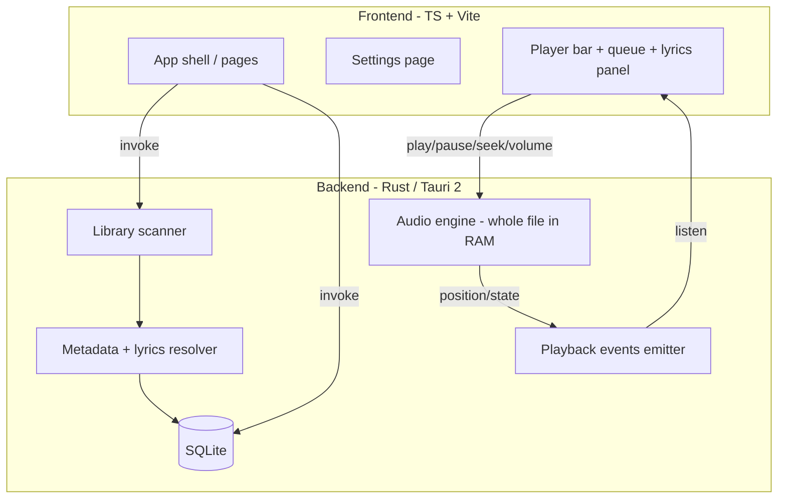
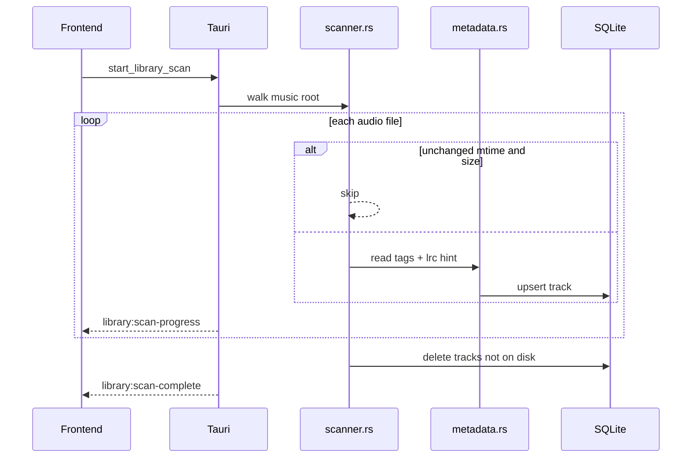
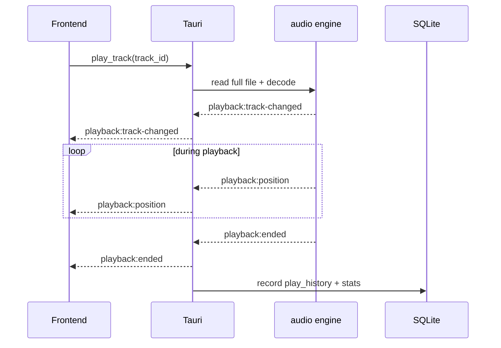
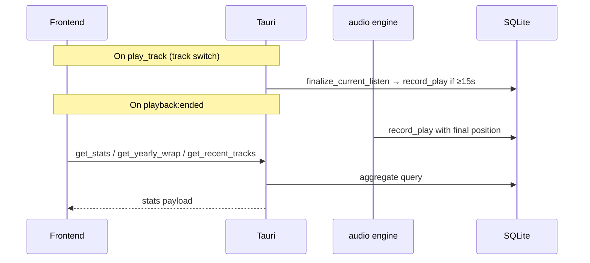

# Brook Architecture

This document records architecture decisions, data models, IPC contracts, and the Brook v1 implementation map.

## Overview

Brook is a Tauri 2 desktop app with a Rust backend and vanilla TypeScript frontend. Rust owns file I/O, metadata, playback, and SQLite. TypeScript owns UI, routing, and UI-only settings in `localStorage`.



---

## Decision log

### ADR-001: Rust-native playback (whole file in memory)

**Status:** Accepted

**Context:** Webview-based playback (`HTMLAudioElement`, blob URLs) is fragile across platforms and couples decode to the webview codec stack.

**Decision:** Decode and play audio entirely in Rust. Read the full file with `std::fs::read`, decode with `symphonia`, output with `rodio`/`cpal`. The UI receives state via Tauri events only.

**Consequences:**

- Reliable playback independent of webview media support
- Higher RAM use for large files (acceptable by design)
- Spectrum visualizer data is computed in Rust (`playback:spectrum` events)

**Non-goals:** Blob URLs, Shaka, HLS, chunked streaming, `HTMLAudioElement`.

---

### ADR-002: SQLite for app data

**Status:** Accepted

**Context:** Browser-side IndexedDB is awkward in a Tauri shell and duplicates data already owned by the scanner.

**Decision:** Store likes, playlists, play history, listening stats, and app settings in SQLite on the Rust side.

**Consequences:**

- Queryable filters (artist, album, year) without loading all tracks into JS
- Single persistence layer aligned with Tauri
- Frontend invokes commands instead of direct DB access

---

### ADR-003: Vanilla TypeScript UI

**Status:** Accepted

**Context:** Brook targets a single-page desktop shell with a large shared stylesheet and imperative DOM updates.

**Decision:** No React/Vue/Svelte. Use token-based CSS and organize TS into `api/`, `ui/`, `player/`, `settings/`.

**Consequences:**

- Closest visual parity with the original design reference
- All Tauri access centralized in `frontend/api/`

---

### ADR-004: Preserve library files as-is (quality + metadata)

**Status:** Accepted

**Context:** The user's `$HOME/Music` library is curated manually — files keep their original encoding quality and embedded tags (ID3, Vorbis comments, etc.). Brook must not degrade or mutate that library.

**Decision:**

- **Read-only access** to audio files on disk. Brook never writes, re-encodes, or transcodes files in the music folder.
- **No tag editing** — metadata is read via `lofty` at scan time and copied into SQLite for search/display only; embedded tags in the file remain the source of truth on disk.
- **No format conversion** — playback decodes in memory for output; the file bytes on disk are unchanged.
- **No “save to library” or download flows** — there is no import pipeline that rewrites files.
- **Optional UI caches** (e.g. extracted cover art thumbnails in app data dir) must not modify files under the music root.
- Sidecar `.lrc` files are read-only unless the user edits them outside Brook.

**Consequences:**

- Library quality and tags stay exactly as the user maintains them
- Brook cannot “fix” or normalize tags in-place (future tag editor would be explicit, opt-in, and out of scope for v1)
- Scan refreshes SQLite when `modified_ms` changes; re-scan picks up external tag edits

**Non-goals:** Transcoding, replay-gain rewriting, embedded art replacement, batch tag writers, FFmpeg export.

---

### ADR-005: Music root resolution

**Status:** Accepted

**Decision:**

- Default: `$HOME/Music` via `dirs::home_dir()` + `"Music"` in Rust
- Optional override in `app_settings.music_root`; settings page offers folder picker + “Use default”
- Changing the music root calls `reset_library_tracks`: clears tracks, play history, stats, and chart playlist rows; favorites and user `playlist_tracks` cascade via FK; user playlist names remain (empty until rescanned)

**Consequences:** Tauri FS scopes must not hardcode user-specific paths in committed config.

---

### ADR-006: Lyrics resolution order

**Status:** Accepted

**Order:**

1. Sidecar `{stem}.lrc` beside the audio file
2. Embedded lyrics tag (via `lofty`)
3. None — hide lyrics UI

**Decision:** Rust loads raw text + source type; TS parses synced LRC timestamps for display.

---

### ADR-007: Settings scope (KISS)

**Status:** Accepted

**Decision:** Settings page covers theme, dynamic colors, shortcuts reference, and music folder controls. Persist UI prefs in `localStorage`. Hardcode playback behavior in Rust — no EQ/gapless/replay-gain UI.

---

## Sequence diagrams

### Library scan



### Playback



### Stats recording



---

## SQLite schema (sketch)

```sql
-- Tracks (populated/refreshed on scan)
CREATE TABLE tracks (
  id              TEXT PRIMARY KEY,  -- relative path from music root
  absolute_path   TEXT NOT NULL,
  extension       TEXT NOT NULL,
  file_size       INTEGER NOT NULL,
  modified_ms     INTEGER NOT NULL,
  title           TEXT,
  artist          TEXT,
  album           TEXT,
  year            INTEGER,
  duration_secs   REAL,
  cover_hash      TEXT,              -- hash or path to cached cover blob
  has_lrc         INTEGER NOT NULL DEFAULT 0,
  lrc_path        TEXT,
  embedded_lyrics TEXT,
  scanned_at      INTEGER NOT NULL
);

CREATE INDEX idx_tracks_artist ON tracks(artist);
CREATE INDEX idx_tracks_album ON tracks(album);
CREATE INDEX idx_tracks_year ON tracks(year);

-- Favorites (likes)
CREATE TABLE favorites (
  track_id        TEXT PRIMARY KEY REFERENCES tracks(id) ON DELETE CASCADE,
  added_at        INTEGER NOT NULL
);

-- Playlists
CREATE TABLE playlists (
  id              TEXT PRIMARY KEY,
  name            TEXT NOT NULL,
  created_at      INTEGER NOT NULL,
  updated_at      INTEGER NOT NULL
);

CREATE TABLE playlist_tracks (
  playlist_id     TEXT NOT NULL REFERENCES playlists(id) ON DELETE CASCADE,
  track_id        TEXT NOT NULL REFERENCES tracks(id) ON DELETE CASCADE,
  position        INTEGER NOT NULL,
  PRIMARY KEY (playlist_id, track_id)
);

-- Play history
CREATE TABLE play_history (
  id              INTEGER PRIMARY KEY AUTOINCREMENT,
  track_id        TEXT NOT NULL REFERENCES tracks(id),
  played_at       INTEGER NOT NULL,
  duration_listened REAL NOT NULL,
  completed       INTEGER NOT NULL DEFAULT 0
);

-- Aggregated stats (updated on play end; optional materialized view)
CREATE TABLE listening_stats (
  track_id        TEXT PRIMARY KEY REFERENCES tracks(id),
  play_count      INTEGER NOT NULL DEFAULT 0,
  total_secs      REAL NOT NULL DEFAULT 0,
  full_listens    INTEGER NOT NULL DEFAULT 0,
  last_played_at  INTEGER
);

-- App settings (key/value JSON or text)
CREATE TABLE app_settings (
  key             TEXT PRIMARY KEY,
  value           TEXT NOT NULL
);
-- Keys: music_root (optional override; absent = $HOME/Music)
```

---

## IPC contract

### Commands (invoke)

| Command | Args | Returns | Notes |
| ------- | ---- | ------- | ----- |
| `get_music_root` | — | `string` | Resolved library path |
| `pick_music_folder` | — | `string \| null` | Native folder picker (null if cancelled) |
| `set_music_root` | `path: string` | `string` | Set override, clear library data, return canonical path |
| `start_library_scan` | — | `()` | Start background scan (no-op if one is already running); emits progress/complete |
| `get_library_facets` | — | `LibraryFacets` | Distinct artists, albums, years, and track count (no full track list) |
| `get_tracks` | `TrackFilter?` | `Track[]` | Filter/sort by artist, album, year, text query |
| `get_track` | `id: string` | `Track` | Single track |
| `get_album_art` | `id: string` | `{ data, mimeType }` or null | Cover bytes for UI |
| `play_track` | `id: string` | `()` | Loads file, starts playback |
| `pause` | — | `()` | |
| `resume` | — | `()` | |
| `seek` | `position_secs: f64` | `()` | Seek within current track |
| `set_volume` | `volume: f32` | `()` | 0.0–1.0 |
| `set_visualizer_active` | `active: bool` | `()` | Enables ~30 Hz `playback:spectrum` events |
| `get_playback_state` | — | `PlaybackState` | Current track, position, status |
| `toggle_favorite` | `track_id: string` | `bool` | New liked state |
| `get_favorites` | — | `Track[]` | |
| `create_playlist` | `name: string` | `Playlist` | |
| `add_to_playlist` | `playlist_id, track_id` | `()` | |
| `remove_from_playlist` | `playlist_id, track_id` | `()` | |
| `get_playlists` | — | `Playlist[]` | |
| `get_playlist_tracks` | `playlist_id: string` | `Track[]` | Ordered |
| `get_stats` | — | `StatsSummary` | All-time aggregates |
| `get_stats_years` | — | `number[]` | Calendar years with play history (descending) |
| `get_yearly_wrap` | `year: i32` | `YearlyWrap` | Calendar-year stats |
| `get_recent_tracks` | `limit?: number` | `Track[]` | Recent play history (default 50) |
| `read_lyrics` | `track_id: string` | `LyricsResult` | `{ source, text }` |

### Events (emit to frontend)

| Event | Payload | When |
| ----- | ------- | ---- |
| `library:scan-progress` | `{ current, total, path? }` | During scan |
| `library:scan-complete` | `{ track_count }` | Scan finished |
| `playback:state` | `{ status: playing\|paused\|stopped }` | State change |
| `playback:position` | `{ position_secs, duration_secs }` | ~4 Hz while playing (250 ms tick) |
| `playback:spectrum` | `{ bins: number[] }` | ~30 Hz while playing and visualizer active |
| `playback:track-changed` | `Track` | New track loaded |
| `playback:ended` | `{ track_id }` | Natural end or stop |
| `db:favorites-changed` | `{ track_id, liked: bool }` | Like toggled |
| `db:playlists-changed` | `{ playlist_id? }` | Playlist CRUD |

### Shared types (serde, camelCase in JSON)

```typescript
interface Track {
  id: string;
  relativePath: string;
  absolutePath: string;
  extension: string;
  title: string;
  artist: string;
  album: string;
  year: number | null;
  durationSecs: number;
  hasLrc: boolean;
  isFavorite: boolean;
}

interface PlaybackState {
  status: "playing" | "paused" | "stopped";
  trackId: string | null;
  positionSecs: number;
  durationSecs: number;
  volume: number;
}

interface PlaybackSpectrumPayload {
  bins: number[];
}

interface LyricsResult {
  source: "lrc" | "embedded" | "none";
  text: string | null;
}

interface LibraryFacets {
  artists: string[];
  albums: string[];
  years: number[];
  trackCount: number;
}

interface TrackFilter {
  artist?: string;
  album?: string;
  year?: number;
  query?: string;
  sortBy?: "title" | "artist" | "album" | "year" | "dateAdded";
  sortOrder?: "asc" | "desc";
}
```

---

## Settings inventory

| Setting | Storage | Functional | Notes |
| ------- | ------- | ---------- | ----- |
| Theme picker | localStorage | Yes | Black, White, Ocean, Purple, Forest |
| Dynamic accent colors | localStorage | Yes | Extract average RGB from cover art in TS |
| Fullscreen player | UI + Rust events | Yes | Cover-first overlay; transport in `.fullscreen-controls`; spectrum opt-in via `#fs-visualizer-btn` and `playback:spectrum` |
| Keyboard shortcuts | — | Yes | Space, arrows (10s seek / volume), M/S/R/L, `/`, `Q`, Esc; shortcuts modal is reference |
| Music folder | Rust query + picker | Yes | Optional override in `app_settings` |

### Hardcoded playback (not in settings UI)

| Setting | Value | Source |
| ------- | ----- | ------ |
| EQ | Off | offline-defaults |
| Graphic EQ | Off | offline-defaults |
| Binaural DSP | Off | offline-defaults |
| Mono audio | Off | offline-defaults |
| Gapless | Off | offline-defaults |
| ReplayGain | Track mode, preamp 1 | offline-defaults |
| Playback speed | 1×, preserve pitch | offline-defaults |
| Exponential volume | Off | offline-defaults |

---

## Explicit non-goals

- Streaming (TIDAL, HLS, Shaka)
- Online lyrics (Genius, etc.)
- Scrobbling (Last.fm, ListenBrainz)
- User accounts / cloud sync
- Podcasts, listening parties, radio
- FFmpeg WASM transcoding in the browser
- Capacitor mobile builds (desktop-first)
- Writing or rewriting audio files / embedded tags in the music library
- Transcoding or downgrading quality (e.g. FLAC → MP3)

---

## Design constraints (offline desktop)

| Concern | Brook approach |
| ----- | --------- |
| Playback reliability | Rust decode/output; no web audio element |
| Music root | `$HOME/Music` via `dirs`; optional SQLite override |
| Library reads | Metadata at scan; play reads file once in Rust |
| Volume | Rust `set_volume` on output stream |
| App data | SQLite in Rust; frontend invokes commands |
| Duration/stats | Seconds end-to-end in schema and UI |
| Scope | Offline-only routes; no streaming/auth/scrobble |

---

## Project layout

```bash
brook/
├── .cursor/rules/       # Agent and convention rules
├── docs/
│   └── ARCHITECTURE.md  # This file
├── frontend/            # UI (vanilla TS + Vite)
│   ├── main.ts
│   ├── api/
│   ├── ui/              # library, search, entity-page, router, playlists, stats
│   ├── player/          # bar, queue, queue-panel, lyrics, visualizer, shortcuts
│   ├── settings/
│   └── public/          # styles.css, images, assets
├── backend/             # Tauri 2 + Rust
│   ├── migrations/
│   ├── tauri.conf.json
│   └── src/
│       ├── lib.rs
│       ├── scanner.rs
│       ├── metadata.rs
│       ├── lyrics.rs
│       ├── db/
│       ├── audio/
│       └── commands/
├── README.md
└── package.json
```

Tauri is configured to use `frontend/` as the web root and `backend/` as the Rust crate (not the default `src-tauri/` layout).

---

## Frontend routes (v1)

| Route | Page |
| ----- | ---- |
| `/library` | Liked + local tracks, filters |
| `/recent` | Recently played |
| `/stats` | All-time stats + yearly wrap |
| `/search` | Global text search (`?q=`) |
| `/artist/:name` | Artist track list |
| `/album/:name` | Album track list |
| `/userplaylist/:id` | Playlist detail |
| `/settings` | Theme, visuals, music folder |

In-memory **play queue** (next/prev/shuffle/repeat, drag reorder) lives in `frontend/player/queue.ts`; the queue modal is UI-only and does not persist to SQLite.

## Implementation status (v1)

Core scaffold, playback, library, playlists, favorites, stats, lyrics, search, entity pages, queue panel, fullscreen transport, and scanner hygiene are implemented. See [overview.md](overview.md) roadmap for the checklist.
