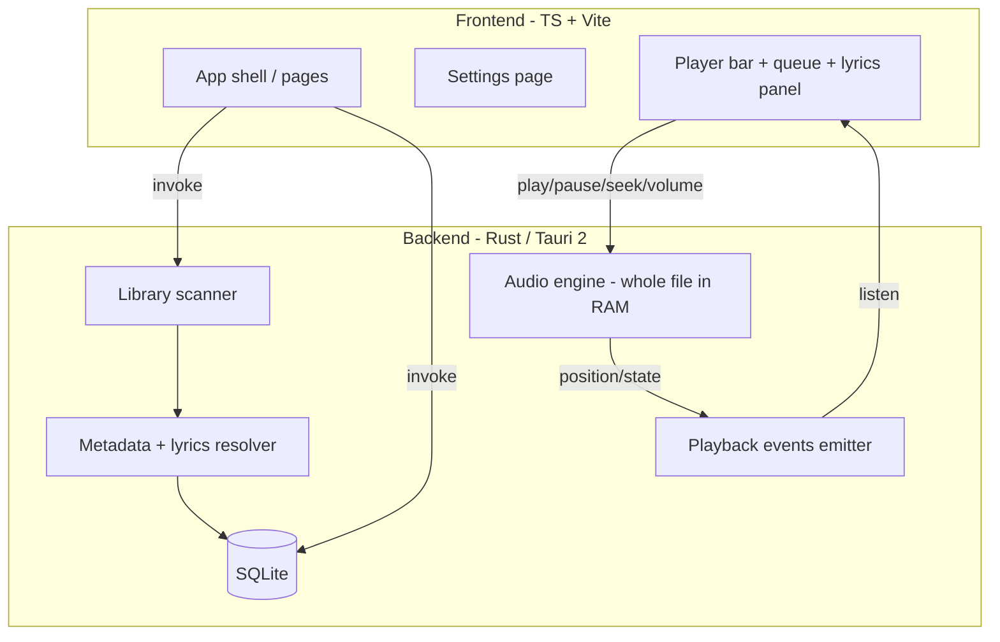
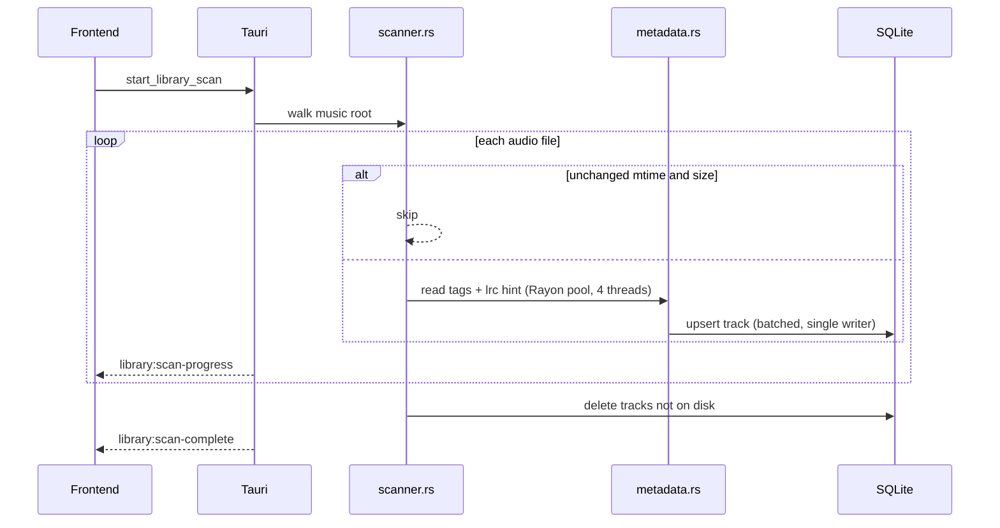
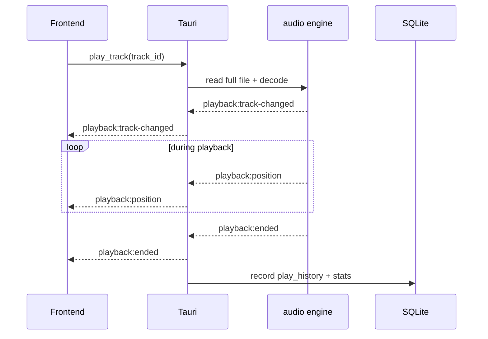
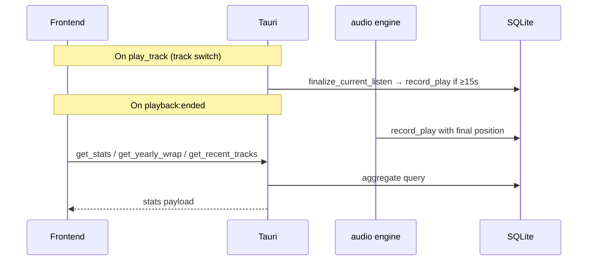

# Brook Architecture

This document records architecture decisions, data models, IPC contracts, and the Brook v1 implementation map.

## Overview

Brook is a Tauri 2 desktop app with a Rust backend and vanilla TypeScript frontend. Rust owns file I/O, metadata, playback, and SQLite. TypeScript owns UI, routing, and UI-only settings in `localStorage`.


```mermaid
flowchart TB
  subgraph ui [Frontend - TS + Vite]
    Shell[App shell / pages]
    Settings[Settings page]
    PlayerUI[Player bar + queue + lyrics panel]
  end

  subgraph rust [Backend - Rust / Tauri 2]
    Scanner[Library scanner]
    Meta[Metadata + lyrics resolver]
    DB[(SQLite)]
    Audio[Audio engine - whole file in RAM]
    Events[Playback events emitter]
  end

  Shell -->|invoke| Scanner
  Shell -->|invoke| DB
  PlayerUI -->|play/pause/seek/volume| Audio
  Audio -->|position/state| Events
  Events -->|listen| PlayerUI
  Scanner --> Meta
  Meta --> DB
```

---

## Decision log

### ADR-001: Rust-native streaming playback

**Status:** Accepted (revised)

**Context:** Webview-based playback (`HTMLAudioElement`, blob URLs) is fragile across platforms and couples decode to the webview codec stack. The first version decoded the whole file into a `Vec<f32>` before playback, which blocked the play command and held large files in RAM.

**Decision:** Decode and play audio entirely in Rust. Open the file with a `MediaSourceStream`, decode with `symphonia` on a background thread into a bounded PCM ring (~2 s), and output with `rodio`/`cpal`. The UI receives state via Tauri events only.

**Consequences:**

- Reliable playback independent of webview media support
- Playback starts as soon as the first frames are decoded; the play command no longer blocks on a full decode
- Bounded RAM use regardless of file size
- Spectrum visualizer data is computed in Rust from the decoder's recent-output tail (`playback:spectrum` events)
- Seek reopens the file and re-arms the decoder at the new timestamp

**Non-goals:** Blob URLs, Shaka, HLS, chunked streaming, `HTMLAudioElement`.

---

### ADR-002: SQLite for app data

**Status:** Accepted

**Context:** Browser-side IndexedDB is awkward in a Tauri shell and duplicates data already owned by the scanner.

**Decision:** Store likes, playlists, play history, listening stats, and app settings in SQLite on the Rust side.

**Consequences:**

- Queryable filters (artist, album, year) without loading all tracks into JS
- Single persistence layer aligned with Tauri
- Frontend invokes commands instead of direct DB access

---

### ADR-003: Vanilla TypeScript UI

**Status:** Accepted

**Context:** Brook targets a single-page desktop shell with a large shared stylesheet and imperative DOM updates.

**Decision:** No React/Vue/Svelte. Use token-based CSS and organize TS into `api/`, `ui/`, `player/`, `settings/`.

**Consequences:**

- Closest visual parity with the original design reference
- All Tauri access centralized in `frontend/api/`

---

### ADR-004: Preserve library files as-is (quality + metadata)

**Status:** Accepted

**Context:** The user's `$HOME/Music` library is curated manually — files keep their original encoding quality and embedded tags (ID3, Vorbis comments, etc.). Brook must not degrade or mutate that library.

**Decision:**

- **Read-only access** to audio files on disk. Brook never writes, re-encodes, or transcodes files in the music folder.
- **No tag editing** — metadata is read via `lofty` at scan time and copied into SQLite for search/display only; embedded tags in the file remain the source of truth on disk.
- **No format conversion** — playback decodes in memory for output; the file bytes on disk are unchanged.
- **No “save to library” or download flows** — there is no import pipeline that rewrites files.
- **Optional UI caches** (e.g. extracted cover art thumbnails in app data dir) must not modify files under the music root.
- Sidecar `.lrc` files are read-only unless the user edits them outside Brook.

**Consequences:**

- Library quality and tags stay exactly as the user maintains them
- Brook cannot “fix” or normalize tags in-place (future tag editor would be explicit, opt-in, and out of scope for v1)
- Scan refreshes SQLite when `modified_ms` changes; re-scan picks up external tag edits

**Non-goals:** Transcoding, replay-gain rewriting, embedded art replacement, batch tag writers, FFmpeg export.

---

### ADR-005: Music root resolution

**Status:** Accepted

**Decision:**

- Default: `$HOME/Music` via `dirs::home_dir()` + `"Music"` in Rust
- Optional override in `app_settings.music_root`; settings page offers folder picker + “Use default”
- Changing the music root calls `reset_library_tracks`: clears tracks, play history, stats, and chart playlist rows; favorites and user `playlist_tracks` cascade via FK; user playlist names remain (empty until rescanned)

**Consequences:** Tauri FS scopes must not hardcode user-specific paths in committed config.

---

### ADR-006: Lyrics resolution order

**Status:** Accepted

**Order:**

1. Sidecar `{stem}.lrc` beside the audio file
2. Embedded lyrics tag (via `lofty`)
3. None — hide lyrics UI

**Decision:** Rust loads raw text + source type; TS parses synced LRC timestamps for display.

---

### ADR-007: Settings scope (KISS)

**Status:** Accepted

**Decision:** Settings keep the track-based Dynamic Color toggle, shortcuts reference, and music folder controls. The manual theme picker is gone. Accent color comes from the local R2-D2 theme document, with bundled monochrome when that document is missing or invalid. Persist the Dynamic Color preference in `localStorage`. Hardcode playback behavior in Rust — no EQ/gapless/replay-gain UI. ReplayGain track gain is still applied automatically at playback from the file's tags (read-only); there is no UI to tune it.

---

## Sequence diagrams

### Library scan


```mermaid
sequenceDiagram
  participant UI as Frontend
  participant Tauri as Tauri
  participant Scan as scanner.rs
  participant Meta as metadata.rs
  participant DB as SQLite

  UI->>Tauri: start_library_scan
  Tauri->>Scan: walk music root
  loop each audio file
    alt unchanged mtime and size
      Scan-->>Scan: skip
    else
      Scan->>Meta: read tags + lrc hint (Rayon pool, 4 threads)
      Meta->>DB: upsert track (batched, single writer)
    end
    Tauri-->>UI: library:scan-progress
  end
  Scan->>DB: delete tracks not on disk
  Tauri-->>UI: library:scan-complete
```

### Playback


```mermaid
sequenceDiagram
  participant UI as Frontend
  participant Tauri as Tauri
  participant Audio as audio engine
  participant DB as SQLite

  UI->>Tauri: play_track(track_id)
  Tauri->>Audio: read full file + decode
  Audio-->>Tauri: playback:track-changed
  Tauri-->>UI: playback:track-changed
  loop during playback
    Audio-->>Tauri: playback:position
    Tauri-->>UI: playback:position
  end
  Audio-->>Tauri: playback:ended
  Tauri-->>UI: playback:ended
  Tauri->>DB: record play_history + stats
```

### Stats recording


```mermaid
sequenceDiagram
  participant UI as Frontend
  participant Tauri as Tauri
  participant Audio as audio engine
  participant DB as SQLite

  Note over UI,Tauri: On play_track (track switch)
  Tauri->>DB: finalize_current_listen → record_play if ≥15s
  Note over UI,Tauri: On playback:ended
  Audio->>DB: record_play with final position
  UI->>Tauri: get_stats / get_yearly_wrap / get_recent_tracks
  Tauri->>DB: aggregate query
  Tauri-->>UI: stats payload
```

---

## SQLite schema (sketch)

```sql
-- Tracks (populated/refreshed on scan)
CREATE TABLE tracks (
  id              TEXT PRIMARY KEY,  -- relative path from music root
  absolute_path   TEXT NOT NULL,
  extension       TEXT NOT NULL,
  file_size       INTEGER NOT NULL,
  modified_ms     INTEGER NOT NULL,
  title           TEXT,
  artist          TEXT,
  album           TEXT,
  year            INTEGER,
  duration_secs   REAL,
  cover_hash      TEXT,              -- hash or path to cached cover blob
  has_lrc         INTEGER NOT NULL DEFAULT 0,
  lrc_path        TEXT,
  embedded_lyrics TEXT,
  scanned_at      INTEGER NOT NULL
);

CREATE INDEX idx_tracks_artist ON tracks(artist);
CREATE INDEX idx_tracks_album ON tracks(album);
CREATE INDEX idx_tracks_year ON tracks(year);

-- Favorites (likes)
CREATE TABLE favorites (
  track_id        TEXT PRIMARY KEY REFERENCES tracks(id) ON DELETE CASCADE,
  added_at        INTEGER NOT NULL
);

-- Playlists
CREATE TABLE playlists (
  id              TEXT PRIMARY KEY,
  name            TEXT NOT NULL,
  created_at      INTEGER NOT NULL,
  updated_at      INTEGER NOT NULL
);

CREATE TABLE playlist_tracks (
  playlist_id     TEXT NOT NULL REFERENCES playlists(id) ON DELETE CASCADE,
  track_id        TEXT NOT NULL REFERENCES tracks(id) ON DELETE CASCADE,
  position        INTEGER NOT NULL,
  PRIMARY KEY (playlist_id, track_id)
);

-- Play history
CREATE TABLE play_history (
  id              INTEGER PRIMARY KEY AUTOINCREMENT,
  track_id        TEXT NOT NULL REFERENCES tracks(id),
  played_at       INTEGER NOT NULL,
  duration_listened REAL NOT NULL,
  completed       INTEGER NOT NULL DEFAULT 0
);

-- Aggregated stats (updated on play end; optional materialized view)
CREATE TABLE listening_stats (
  track_id        TEXT PRIMARY KEY REFERENCES tracks(id),
  play_count      INTEGER NOT NULL DEFAULT 0,
  total_secs      REAL NOT NULL DEFAULT 0,
  full_listens    INTEGER NOT NULL DEFAULT 0,
  last_played_at  INTEGER
);

-- App settings (key/value JSON or text)
CREATE TABLE app_settings (
  key             TEXT PRIMARY KEY,
  value           TEXT NOT NULL
);
-- Keys: music_root (optional override; absent = $HOME/Music)
```

---

## IPC contract

### Commands (invoke)

| Command | Args | Returns | Notes |
| ------- | ---- | ------- | ----- |
| `get_music_root` | — | `string` | Resolved library path |
| `pick_music_folder` | — | `string \| null` | Native folder picker (null if cancelled) |
| `set_music_root` | `path: string` | `string` | Set override, clear library data, return canonical path |
| `start_library_scan` | — | `()` | Start background scan (no-op if one is already running); emits progress/complete |
| `get_library_facets` | — | `LibraryFacets` | Distinct artists, albums, years, and track count (no full track list) |
| `get_tracks` | `TrackFilter?` | `Track[]` | Filter/sort by artist, album, year, text query (whole result set) |
| `get_tracks_page` | `TrackFilter?` (with `limit`/`offset`) | `TracksPage` | One page plus the total count for the same filter; the local list paginates with this |
| `get_tracks_count` | `TrackFilter?` | `number` | Count of matching tracks (ignores `limit`/`offset`); sizes the virtual list's scroll height |
| `get_track` | `id: string` | `Track` | Single track |
| `get_album_art` | `id: string` | `{ data, mimeType }` or null | Full cover bytes (player / now-playing / detail header) |
| `get_album_art_thumb` | `id: string` | `{ data, mimeType }` or null | Small (96px) JPEG list thumbnail, cached beside the full cover |
| `get_album_art_batch` | `ids: string[]` | `Array<{ id, art }>` | List thumbnails for many ids in one IPC round-trip |
| `play_track` | `id: string` | `()` | Opens the file and starts streaming playback. Does not replace the queue |
| `play_queue` | `ids: string[], currentId: string` | `QueueSnapshot` | Replace the queue and start `currentId` |
| `get_queue` | — | `QueueSnapshot` | Tracks, current id, next id, shuffle, repeat |
| `queue_insert_next` | `id: string` | `QueueSnapshot` | Play this track after the current one |
| `queue_append` | `id: string` | `QueueSnapshot` | Add to the end unless it is already queued |
| `queue_remove` | `id: string` | `QueueSnapshot` | Removing the current track starts the one that slides into place |
| `queue_reorder` | `fromIndex: number, toIndex: number` | `QueueSnapshot` | |
| `queue_jump` | `id: string` | `QueueSnapshot` | Play that queued track |
| `queue_clear` | — | `QueueSnapshot` | Keep the current track |
| `queue_toggle_shuffle` | — | `QueueSnapshot` | |
| `queue_cycle_repeat` | — | `QueueSnapshot` | `off` → `all` → `one` |
| `queue_next` | — | `QueueSnapshot` | Next track. No-op at the end unless repeat wraps |
| `queue_previous` | — | `QueueSnapshot` | Seek to 0 if position > 3s, otherwise the previous track |
| `play_current` | — | `()` | Start the queued track when the engine is stopped |
| `set_upcoming_track` | `id: string \| null` | `()` | Low-level preload. The session sets this from the queue after every change |
| `pause` | — | `()` | |
| `resume` | — | `()` | |
| `seek` | `position_secs: f64` | `()` | Seek within current track |
| `set_volume` | `volume: f32` | `()` | 0.0–1.0 |
| `set_visualizer_active` | `active: bool` | `()` | Enables ~30 Hz `playback:spectrum` events |
| `stop` | — | `()` | Stop playback without emitting `playback:ended` (MPRIS Stop) |
| `set_mpris_controls` | `shuffle: bool, repeat: string` | `()` | Set shuffle and repeat on the session, which publishes them to MPRIS (Linux only) |
| `get_playback_state` | — | `PlaybackState` | Current track, position, status |
| `toggle_favorite` | `track_id: string` | `bool` | New liked state |
| `get_favorites` | — | `Track[]` | |
| `create_playlist` | `name: string` | `Playlist` | |
| `add_to_playlist` | `playlist_id, track_id` | `()` | |
| `remove_from_playlist` | `playlist_id, track_id` | `()` | |
| `get_playlists` | — | `Playlist[]` | |
| `get_playlist_tracks` | `playlist_id: string` | `Track[]` | Ordered |
| `get_stats` | — | `StatsSummary` | All-time aggregates |
| `get_stats_years` | — | `number[]` | Calendar years with play history (descending) |
| `get_yearly_wrap` | `year: i32` | `YearlyWrap` | Calendar-year stats |
| `get_recent_tracks` | `limit?: number` | `Track[]` | Recent play history (default 50) |
| `read_lyrics` | `track_id: string` | `LyricsResult` | `{ source, text }` |
| `get_shared_theme` | — | `SharedTheme` | Valid local theme, or bundled monochrome when the file is missing or invalid |

### Events (emit to frontend)

| Event | Payload | When |
| ----- | ------- | ---- |
| `library:scan-progress` | `{ current, total, path? }` | During scan |
| `library:scan-complete` | `{ track_count }` | Scan finished |
| `playback:state` | `{ status: playing\|paused\|stopped }` | State change |
| `playback:position` | `{ position_secs, duration_secs }` | ~4 Hz while playing (250 ms tick) |
| `playback:spectrum` | `{ bins: number[] }` | ~30 Hz while playing and visualizer active |
| `playback:track-changed` | `Track` | New track loaded via `play_track` |
| `playback:advanced` | `{ track: Track }` | Gapless handoff to a preloaded next track. The session moves the queue; the UI refreshes the now-playing track |
| `playback:ended` | `{ track_id }` | Natural end. The session starts the next queued track when there is one |
| `playback:session-idle` | — | Natural end and the queue has nothing else to play |
| `queue:changed` | `QueueSnapshot` | Queue, shuffle, or repeat changed, including MPRIS and gapless advance |
| `db:favorites-changed` | `{ track_id, liked: bool }` | Like toggled |
| `db:playlists-changed` | `{ playlist_id? }` | Playlist CRUD |
| `theme:changed` | `SharedTheme` | Local theme file replaced, removed, or rejected |

### Shared types (serde, camelCase in JSON)

```typescript
interface Track {
  id: string;
  relativePath: string;
  absolutePath: string;
  extension: string;
  title: string;
  artist: string;
  album: string;
  year: number | null;
  durationSecs: number;
  hasLrc: boolean;
  isFavorite: boolean;
}

interface QueueSnapshot {
  tracks: Track[];
  currentId: string | null;
  nextId: string | null;
  shuffle: boolean;
  repeat: "off" | "all" | "one";
}

interface PlaybackState {
  status: "playing" | "paused" | "stopped";
  trackId: string | null;
  positionSecs: number;
  durationSecs: number;
  volume: number;
}

interface PlaybackSpectrumPayload {
  bins: number[];
}

interface LyricsResult {
  source: "lrc" | "embedded" | "none";
  text: string | null;
}

interface LibraryFacets {
  artists: string[];
  albums: string[];
  years: number[];
  trackCount: number;
}

interface TrackFilter {
  artist?: string;
  album?: string;
  year?: number;
  query?: string;
  sortBy?: "title" | "artist" | "album" | "year" | "dateAdded";
  sortOrder?: "asc" | "desc";
}

interface SharedTheme {
  available: boolean;
  revision: string;
  accent: {
    source: string;
    text: string;
    border: string;
    control: string;
    onControl: string;
    rgb: string;
  };
}
```

---

## Settings inventory

| Setting | Storage | Functional | Notes |
| ------- | ------- | ---------- | ----- |
| Theme picker | localStorage | Yes | Black, White, Ocean, Purple, Forest |
| Dynamic accent colors | localStorage | Yes | Extract average RGB from cover art in TS |
| Fullscreen player | UI + Rust events | Yes | Cover-first overlay; transport in `.fullscreen-controls`; spectrum opt-in via `#fs-visualizer-btn` and `playback:spectrum` |
| Keyboard shortcuts | — | Yes | Space, arrows (10s seek / volume), M/S/R/L, `/`, `Q`, Esc; shortcuts modal is reference |
| Music folder | Rust query + picker | Yes | Optional override in `app_settings` |

### Hardcoded playback (not in settings UI)

| Setting | Value | Source |
| ------- | ----- | ------ |
| EQ | Off | offline-defaults |
| Graphic EQ | Off | offline-defaults |
| Binaural DSP | Off | offline-defaults |
| Mono audio | Off | offline-defaults |
| Gapless | On (next-track preload) | Rust queue calls `set_upcoming_track` after each change |
| ReplayGain | Track mode, applied at playback from tags (read-only) | `REPLAYGAIN_TRACK_GAIN`/`_PEAK` read at scan, scaled at the sink |
| Playback speed | 1×, preserve pitch | offline-defaults |
| Exponential volume | Off | offline-defaults |

---

## Explicit non-goals

- Streaming (TIDAL, HLS, Shaka)
- Online lyrics (Genius, etc.)
- Scrobbling (Last.fm, ListenBrainz)
- User accounts / cloud sync
- Podcasts, listening parties, radio
- FFmpeg WASM transcoding in the browser
- Capacitor mobile builds (desktop-first)
- Writing or rewriting audio files / embedded tags in the music library
- Transcoding or downgrading quality (e.g. FLAC → MP3)

---

## Design constraints (offline desktop)

| Concern | Brook approach |
| ----- | --------- |
| Playback reliability | Rust decode/output; no web audio element |
| Music root | `$HOME/Music` via `dirs`; optional SQLite override |
| Library reads | Metadata at scan; play reads file once in Rust |
| Volume | Rust `set_volume` on output stream |
| App data | SQLite in Rust; frontend invokes commands |
| Duration/stats | Seconds end-to-end in schema and UI |
| Scope | Offline-only routes; no streaming/auth/scrobble |
| Large libraries | Parallel `lofty` tag reads on a 4-thread Rayon pool; paged `get_tracks` + viewport recycler so only visible rows are in the DOM; small (96px) cached cover thumbnails served to lists, full art to the player; batched cover fetch in one IPC |
| Single instance | `tauri-plugin-single-instance` focuses the running window on a second launch; a later CLI can sit on the same channel |

---

## Project layout

```bash
brook/
├── .cursor/rules/       # Agent and convention rules
├── docs/
│   └── ARCHITECTURE.md  # This file
├── frontend/            # UI (vanilla TS + Vite)
│   ├── main.ts
│   ├── api/
│   ├── ui/              # library, search, entity-page, router, playlists, stats
│   ├── player/          # bar, queue-panel, lyrics, visualizer, shortcuts
│   ├── settings/
│   └── public/          # styles.css, images, assets
├── backend/             # Tauri 2 + Rust
│   ├── migrations/
│   ├── tauri.conf.json
│   └── src/
│       ├── lib.rs
│       ├── scanner.rs
│       ├── metadata.rs
│       ├── lyrics.rs
│       ├── db/
│       ├── audio/
│       ├── queue.rs
│       ├── session.rs
│       └── commands/
├── README.md
└── package.json
```

Tauri is configured to use `frontend/` as the web root and `backend/` as the Rust crate (not the default `src-tauri/` layout).

---

## Frontend routes (v1)

| Route | Page |
| ----- | ---- |
| `/library` | Liked + local tracks, filters |
| `/recent` | Recently played |
| `/stats` | All-time stats + yearly wrap |
| `/search` | Global text search (`?q=`) |
| `/artist/:name` | Artist track list |
| `/album/:name` | Album track list |
| `/userplaylist/:id` | Playlist detail |
| `/settings` | Theme, visuals, music folder |

In-memory **play queue** (next/prev/shuffle/repeat, drag reorder) lives in the Rust session (`backend/src/queue.rs`). It is not persisted to SQLite. The queue panel is a view of `get_queue` / `queue:changed`.

`brook --headless` starts the session with no window. A second launch without that flag opens the window on the running process. Closing the window hides it when the process was started headless. `brook --quit` exits the process. `brook --uninstall` removes the AppImage install and leaves library data in place. `brook --uninstall --clear-history` also removes listening history and cached cover art.

## Implementation status (v1)

Core scaffold, playback, library, playlists, favorites, stats, lyrics, search, entity pages, queue panel, fullscreen transport, and scanner hygiene are implemented. See [overview.md](overview.md) roadmap for the checklist.
